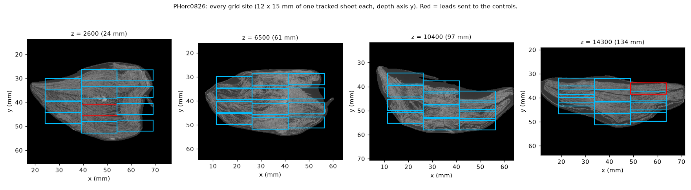
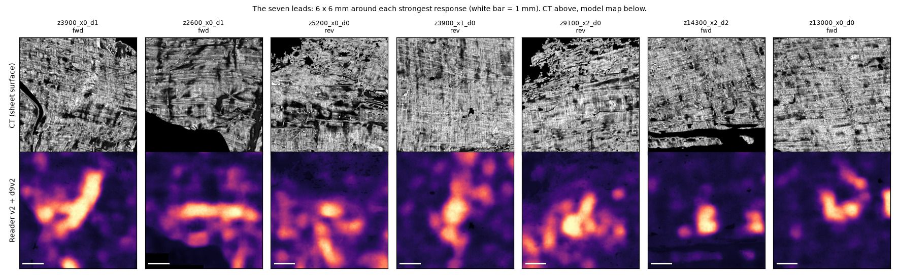
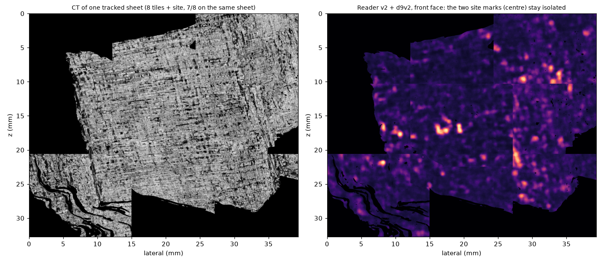
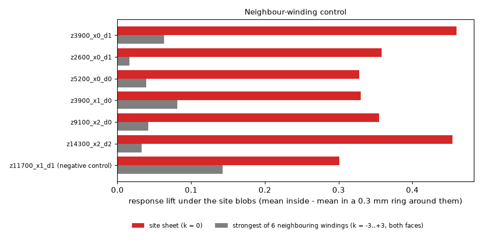
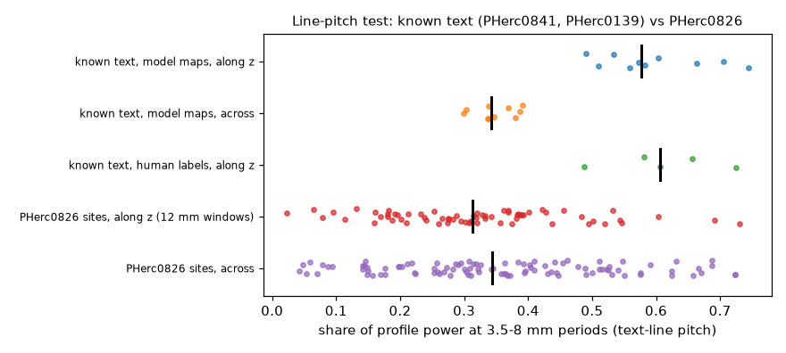

# PHerc0826 First Letters search: 150 on-sheet sites, three controls, no text

**In one sentence:** I tracked single sheets of PHerc0826 at 150 sites through the whole roll (162 cm² of sheet surface), read every one with two 9 µm ink readers, sent the seven best leads through three controls, and found no text.

**Plus six more scrolls:** the same search on PHerc0358, 0813, 0175A, 0343, 0211 and 0483B (706 sites, 682 cm² of sheet) found no text either (see *Six more scrolls*).

**Why this is useful:** PHerc0826 is the eligible 9 µm scan that looks most like the scrolls where ink was found (sheet-contrast atlas, claudepro1515), so the next person will look here first. The published 0826 nulls read surfaces from the spiral-fit workflow; the fit audit (claudepro1515) found the published 0826 fits no closer to the sheets than chance, and Scheirer's re-check of his own fits agrees for two of his three bands. These surfaces sit on the sheet: each one is grown along a single sheet of the organisers' m7 prediction and rendered along its normal. The site list, every score and the controls are in `results/`, so a reader can be re-run on exactly these places, or skip them.



## What was done

**Scan and surfaces.** PHerc0826, volume `20250821151701` (9.362 µm, 1.2 m, 113 keV), m7 surface prediction `20260413222639` (th 0.2). The roll is flattened about 3:1 with the long axis along x, so the sheets run along x almost everywhere. A first plan with boxes on all four sides failed on the x sides (looking along the sheets), so the final plan uses depth axis y everywhere: 12 heights (every 1300 voxels, 12 mm) × up to 3 side-by-side tiles × 4 depths through the local thickness = 136 sites (some tiles fall outside the roll near its ends), all read, plus 14 from the first plan. Each site is one sheet over 12 × 15 mm, grown best-first along m7 run centres, rendered along the smoothed normal (28 layers).

**Readers.** Reader v2 (Domenico Russo, MIT) and d9v2 (this repo, see below), both faces, averaged per face. v8-in (Youssef Nader) was added for the leads.

**Screening.** Ranked by the strongest 2 mm window, row structure and one-sidedness, down-weighting responses that are one connected slab. The top 15 and every strong, one-sided, non-slab site were checked by eye. What the readers light up on this scroll: slabs that stop at a crack or contact boundary, blobs along void and delamination edges, an even ~1 mm blob grid over clean fibre texture, folds, and the outer edge.

**Seven leads went to up to three controls (table below):**

1. **Neighbouring windings.** For each lead, the sheets 1 to 3 crossings deeper and shallower were built by counting m7 runs column by column from the lead's sheet, then read the same way. Ink sits on one sheet; a crack or compression zone crosses several. All six leads tested are specific to their own sheet: lift under the lead 0.33 to 0.46, at most 0.08 on any neighbour. A known artefact (a slab cut off by a crack, `z11700_x1_d1`) used as a negative control echoes 0.14 on the adjacent winding (r 0.52), so the test does catch at least contact-zone artefacts.
2. **Context.** For three leads, the same sheet was followed into the 8 surrounding tiles (33 × 39 mm; seams checked in depth: 6 of 8 and 7 of 8 tiles stay on the sheet for the two best). Text continues; these marks do not. In all three, the lead is the only mark of its kind on its sheet.
3. **Line pitch (inconclusive).** Text lines stack along the scroll axis every few mm. On known text (PHerc0841 ×3, PHerc0139 w030/w045) the z-profile puts 0.49 to 0.74 of its power at 3.5 to 8 mm periods, against 0.30 to 0.39 across the lines. PHerc0826 sites sit at the null (median 0.31), but a 12 mm site is barely two periods long, so single sites are noisy (a few reach 0.7), and the context mosaics have tile seams every 10.3 mm that add harmonics of their own (one mosaic scores 0.56). Kept as a calibrated tool, not as evidence either way.

| lead | face | what it is | neighbours | v8-in | context |
|---|---|---|---|---|---|
| z3900_x0_d1 | fwd | hook-shaped stroke, 3.7 × 1 mm | sheet-specific | agrees (0.52 / 0.15) | isolated (same sheet in 2 of 5 tiles read) |
| z13000_x0_d0 | fwd | V-shaped mark + short bar | not run | - | isolated, 33 × 39 mm, 7/8 tiles on sheet |
| z14300_x2_d2 | fwd | two compact blobs, 2.3 mm apart | sheet-specific | agrees (0.37 / 0.06) | two of many in an even speckle |
| z2600_x0_d1 | fwd | bar on a fibre bundle between two cracks | sheet-specific | two-sided (0.35 / 0.32) | - |
| z3900_x1_d0 | rev | letter-sized blob cluster | sheet-specific | weak (0.26 / 0.11) | - |
| z5200_x0_d0 | rev | soft blob field | sheet-specific | agrees (0.48 / 0.10) | - |
| z9100_x2_d0 | rev | blob clusters along a crack | sheet-specific | agrees (0.62 / 0.27) | - |






v8-in agreeing on the face is weak evidence by itself: it also agrees on blob fields that are plainly texture.

## Six more scrolls

The same protocol, run on the next eligible scans in the sheet-contrast atlas order that have an m7 surface prediction, with `search/dense_any.py`, which works on any scroll: PHerc0358 is crushed diagonally and PHerc0813 is roughly round, so each site's depth axis is chosen from the local sheet orientation (structure tensor of the CT slice) instead of a fixed axis. Sites sit on a 1200-voxel grid inside the scroll at heights every 1300 voxels.

| scroll | volume | sites read | sheet area | strong sites (≥ 0.5) | after review |
|---|---|---|---|---|---|
| PHerc0358 | `20250821151737` (9.362 µm) | 99 | 100 cm² | 5 | no lead: crumpled and folded papyrus, blob fields |
| PHerc0813 | `20250821151723` (9.362 µm) | 124 | 126 cm² | 8 | no lead: slabs by folds, fibre bands above seams, blob fields |
| PHerc0175A | `20250521115057` (8.64 µm) | 126 | 111 cm² | 16 | no lead: blob fields on CT-bright patches, creases, edge blobs; more strong sites on the reverse face |
| PHerc0343 | `20250521140437` (8.64 µm) | 140 | 130 cm² | 10 | no lead: slabs by folds and voids; two isolated marks tested (below) |
| PHerc0211 | `20250821151803` (9.362 µm) | 110 of 114 | 121 cm² | 7 | no lead: blob fields, fibre-band rows; reverse-face clusters at z ≈ 9100 |
| PHerc0483B | `20251124083638` (8.64 µm) | 107 | 94 cm² | 3 | no lead: blob clusters on heavily folded papyrus |

- **Reader for the last four scrolls.** PHerc0175A, 0343, 0211 and 0483B were read with Reader v2 plus the letter-shape reader d9v4C ([9um-reader-letter-shape](https://github.com/TAUIL-Abd-Elilah/9um-reader-letter-shape), release v1.0) in place of d9v2. In their score files the `d9v2_*` and `ens_*` keys hold that pair; `campaign.json` says so.
- **Two isolated marks on PHerc0343 were tested.** Both are on the forward (text) face.
  - z10400_y3000_x5400 (two bars) passed the neighbour-winding control: +0.38 on its sheet, at most +0.03 on six neighbours. Followed along the same sheet, its bar is part of a thin streak about 10 mm long that runs along the horizontal fibres, with nothing letter-like nearby. Not letters.
  - z7800_y6600_x5400 (a hook about 2.6 × 1.8 mm) passed the neighbour control too (+0.52, about 0 on neighbours). Seven of its eight context tiles stayed on the same sheet, about 33 × 40 mm of clean papyrus. On that area the other strong marks sit on bright CT inclusions or a crack, and the hook is alone. Not claimable.
- **PHerc0211's reverse-face clusters.** The large clusters on PHerc0211 at z ≈ 9100 are on the face a roll usually leaves blank. They match the inner-wrap reverse-face feature seen on that scroll's published segments in September, which also reads on both faces higher up, so it is treated as structure.

Site lists, every score and the rankings are in `results/other_scrolls/`. The control scripts (`neighbors.py`, `extend_site.py`, `reread_v8in.py`) take `CAMPAIGN_DIR` and work on these campaigns too.

## The reader (d9v2)

132 published segments have both a native ~9 µm surface volume and the organisers' ~2.4 µm `new_canon` ink prediction (PHerc0009B 18, 0139 38, 0343P 8, 0500P2 46, 0814 19, 0841 3). The prediction is moved onto the 9 µm canvas and used as a dense target to fine-tune the released `ink_9um` (hybrid_3d2d seed 42, step 75k), 12k steps, batch 24, per-scroll balanced. Eight segments with the organisers' human labels (20260918 set) are held out, including all three PHerc0841 segments (no PHerc0841 data in our training set, and not in `ink_9um`'s). This is the same idea as Domenico Russo's retraining from dense teacher labels (Reader v2) and Erwin Nieuwlaar's dense pseudo-labels; here it is done on the native 9 µm renders of six scrolls.

Human-label AUC on the held-out segments:

| model | mean, 8 segments | PHerc0841 (unseen) |
|---|---|---|
| ink_9um s42 (released) | 0.794 | 0.736 |
| Scheirer reader-ft-s42 | 0.860 | 0.813 |
| Reader v2 | 0.856 | 0.826 |
| d9v2 | 0.856 | 0.828 |
| d9v3 (labels realigned, below) | 0.856 | 0.824 |
| Reader v2 + d9v2 (mean of maps) | 0.867 | **0.840** |
| Reader v2 + Scheirer + d9v3 | **0.871** | 0.835 |

d9v2 ties Reader v2. The gain is from averaging readers trained independently: +0.012 on PHerc0841 and +0.011 over all eight segments, against the best single reader on each.

**One alignment pitfall, for anyone doing the same.** Stretching the 2.4 µm canvas onto the 9 µm canvas (what the `.zattrs` scales suggest: both declare translation 0) leaves a 45 to 75 µm shift between them. Registering the CT texture of the two published renders, without any model, gives a constant (−8, −8) px on PHerc0139, 0500P2 and 0814, (−6, −7) on 0841 and (−5, −8) on 0009B (`reader/texture_reg.py`, `results/reader/texture_offsets.json`). villa's `tifxyz_label_transfer` handles this properly by matching the surfaces in 3D; a plain resize does not. My first per-scroll correction measured the offset by correlating a reader's map with the label on the sparse training blocks, and the block borders made the correlation flat over ±8 px, which put PHerc0500P2 and 0814 11 to 12 px the wrong way. `reader/realign_rv2.py remeasure` uses a high-pass that ignores everything outside each block and recovers the right offset. Retraining on the corrected labels (d9v3) changed nothing, and the standard human-label AUC moves by at most 0.005 when the labels are shifted by 60 µm (PHerc0841, Reader v2 and ink_9um), so this metric cannot see the problem.

## Limits

- 150 sites is a sample, not the scroll: about 162 cm² of tracked sheet at 12 heights. The ends of the flattened roll (folds) are thin in the sample.
- Every reader here is a 9 µm reader. On PHerc0841, where the 2.4 µm predictions show text, the same readers render letters as blobs (villa #1907), so a null at 9 µm says the ink is below what these readers show, not that it is absent.
- The neighbour control was checked against one negative control only.
- The line-pitch test needs more than the 12 mm a single site gives.

## Run it

Python 3.14, torch 2.13 (villa needs ≥ 2.12), the `vesuvius` package from villa (commit `8d6e1e9`), and the checkpoints under `$FLS_ROOT/_fl/ckpt/`: `hybrid_3d2d-seed42/step-075000.pth` (huggingface.co/scrollprize/ink_9um), `reader_v2/reader-v2-step040000.pth` (huggingface.co/domenicor046/reader-v2), `scheirer_ft_s42/ink9um_ft_s42_step12000.pth` (ShribyrLabs/vesuvius-reports, release reader-ft-s42), `v8in/` (huggingface.co/YoussefMoNader/ink-8um-v8in). Data streams from the open bucket.

```bash
export FLS_ROOT=/path/to/root CAMPAIGN_DIR=/path/to/campaign ROUTE24_CACHE=/path/to/cache D9_DATA=/path/to/corpus
python search/dense0826b.py                      # 136 sites -> $CAMPAIGN_DIR/<site>/ (scores.json, maps, ct.png)
python search/dense_review.py $CAMPAIGN_DIR 15   # ranking + montages
python search/neighbors.py z3900_x0_d1 fwd       # neighbouring windings k = -3..+3
python search/extend_site.py z13000_x0_d0 fwd    # 8 surrounding tiles on the same sheet
python search/reread_v8in.py z3900_x0_d1         # v8-in, both faces
python search/row_period.py                      # line-pitch calibration
python search/dense_any.py --scroll PHerc0813 --vol <volume> --pred <m7 prediction> --out <dir>   # any scroll

python reader/pack9.py <scroll>/<segment> ...    # corpus (see reader/segments.txt)
python reader/realign_rv2.py remeasure && touch $D9_DATA/apply_go && python reader/realign_rv2.py apply
python reader/ft9v2.py --train $(sed 's#/#__#' reader/train.txt) --init $FLS_ROOT/_fl/ckpt/hybrid_3d2d-seed42/step-075000.pth \
    --out runs/d9v3 --steps 12000 --batch 24 --lr 1e-3 --save-every 4000
python reader/eval9v2.py --segments $(sed 's#/#__#' reader/test.txt) --out results_eval_v3.json \
    --ckpt reader_v2=$FLS_ROOT/_fl/ckpt/reader_v2/reader-v2-step040000.pth d9v3_12k=runs/d9v3/ft-012000.pth
python reader/compare_v3.py
python reader/texture_reg.py PHerc0814/segments/20260226000000-46527_2um_try2   # model-free canvas offset
```

The scripts are the copies that produced the numbers; `pack9.py` and `align9.py` keep the first (superseded) alignment for the record. Weights: release [v1.0](../../releases/tag/v1.0), `d9v2_ft-012000.pth` (SHA-256 `50d2ad0ef7690a6a422640804d38f01409da8bc96cfc1ab72f45324a4a18f966`) and `d9v3_ft-012000.pth` (SHA-256 `e28f7172425b82bcc158c04ffb989cb8016bdd22ede4834a2621d35bd45a9ec1`), fine-tuned from the released `ink_9um`; they load like any `ink_9um` checkpoint. One RTX 3090, 32 GB RAM; a site takes about 2 minutes, a training run 1.3 to 2 hours.

Related: [cross-scan-ink-transfer](https://github.com/TAUIL-Abd-Elilah/cross-scan-ink-transfer) (September: native PHerc0139 fine-tune, letter-scale scores), ShribyrLabs/vesuvius-reports (Scheirer, 0826 null and 9 µm reader benchmark), Bullo27/first-letters-survey, claudepro1515/first-letters-fit-audit and first-letters-scan-atlas.

Developed with AI assistance under my direction.

Code MIT. Data, figures and derived maps: Vesuvius Challenge open data, CC BY-NC 4.0.
